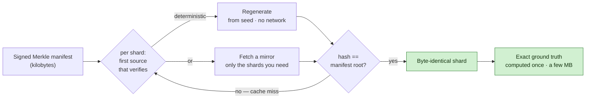
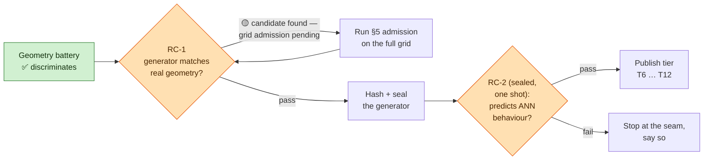

# OpenVector Bench

[](https://github.com/ahb-sjsu/openvector-bench/actions/workflows/ci.yml)
[](pyproject.toml)
[](LICENSE)
[](LICENSE-DATA)
[](#status-and-results)
[](https://github.com/astral-sh/ruff)
[](https://github.com/psf/black)

A **nested, content-addressed benchmark family** for vector search at
**10⁶–10¹² rows**, with three independent notions of a correct answer.

> **Status: design & validation stage — no tier is published yet.** The specs are
> registered and the geometry battery runs; nothing above the real/procedural seam
> ships until the registered validations (RC-1, RC-2) pass — and if they fail, the
> family stops at the seam and says so. **[→ Status and results](#status-and-results)**

## The idea in one picture

A 10¹² corpus is ~128 TB — too big to host or hand out. So the corpus *is* a
signed manifest of kilobytes: you rebuild the bytes yourself, and every one is
hash-verified against the manifest either way.



Every tier is a **strict subset** of the next, so a recall change is about *N*,
not the data; ground truth and per-query difficulty strata are published per tier.

## Quickstart

```bash
pip install -e ".[dev]"      # numpy + scipy (+ ruff/black/pytest for dev)
pytest -q                    # manifest, generator determinism, geometry battery

# Rebuild a corpus end to end, credential-free (publish → delete → regenerate → verify):
jupyter notebook notebooks/reproduce.ipynb
# …or the registered §6 reconstruction experiment with machine-readable pass criteria:
python harness/distribution/reconstruct_experiment.py --help
```

---

## Why

Three problems with how vector search is currently benchmarked:

**1. Scale and distribution are confounded.** Results at 10⁶ and 10⁹ are
reported on *different corpora*, so when recall falls between them, nobody can
separate "search got harder with N" from "the data changed". Here every tier
is a strict subset of the next — the distribution is fixed and only N varies.

**2. Billion-scale corpora cannot be distributed, so few people evaluate at
scale.** A 10¹² corpus is ~128 TB. This benchmark distributes a *signed Merkle
manifest* instead: fetch kilobytes, then either regenerate shards
deterministically or fetch only the shards you need, every byte hash-verified.
The expensive artifact — exact ground truth for a fixed query set — is
computed once and published as a few MB.

**3. One metric is reported where three differ.** A system can reproduce its
own ranking almost perfectly while diverging from true nearest neighbours, and
preserve true neighbours while degrading actual relevance. Measurements
motivating this benchmark found recall **0.999** against an index's own exact
ranking and **0.592** against fp32 truth *for the same queries at the same
instant*. A benchmark that reports one number cannot see that.

## Three truth layers

| layer | what it is | scale | cost |
|---|---|---|---|
| **L1** geometric | exact k-NN under the frozen metric | every tier | one exhaustive pass per tier |
| **L2** structural | relevance from links, citations, Q→A, cross-language pairs | corpus-scale | free, but *biased* — bias statistics ship with the labels |
| **L3** human | independent relevance judgments | 10³–10⁴ queries | reuse existing judged sets where licensing permits |

Queries carry **difficulty strata** (local intrinsic dimension, neighbour
margin, hubness exposure, neighbour dispersion, L1/L2 disagreement) so results
are reported by stratum — average recall conceals exactly the failures worth
studying.

## Tiers

`T6 … T12` (10⁶ … 10¹² rows), each a strict subset of the next. Membership is
a published content-addressed permutation, **not a prefix** — sources arrive
ordered by language, dump, or crawl date, and a prefix would make the small
tiers monolingual and poison every cross-scale comparison.

**The real/procedural seam is labelled per tier.** No public corpus of real
neural embeddings exists much beyond 10⁹. Tiers above the seam are
procedurally generated and are legitimate only insofar as the registered
validations hold:

- **RC-1** — is the generated corpus geometrically equivalent to real
  embeddings on the properties that govern ANN search, over a prespecified
  grid of sample size and neighbourhood scale? (`spec/PREREG_RC1.md`)
- **RC-2** — does matching that geometry *predict ANN behaviour never used in
  fitting* (IVF recall curves, cell occupancy, margin distributions, rerank
  depth)? Sealed; opened once against one hashed generator.

Ground truth is **not** nested — a query's true neighbours change as the
corpus grows — so GT is computed and published per tier.

## Status and results

Design-and-validation stage: the instrument is built and the seam is being
tested. **No tier is published** — nothing above the real/procedural seam ships
until RC-1 and RC-2 hold. Where each piece stands, with every artifact committed
as produced:

| Milestone | What it proves | Status | Evidence |
|---|---|:---:|---|
| **Geometry battery** (RC-1 instrument) | the battery tells real embeddings from wrong ones | ✅ **passed** | 3/3 frozen nulls rejected · [`RC1_ROUND1.md`](results/RC1_ROUND1.md) |
| **§6 reconstruction** | a corpus regenerates **byte-identically** from a kB manifest | ✅ **passed** | 4/4 criteria · [experiment](harness/distribution/reconstruct_experiment.py) · [notebook](notebooks/reproduce.ipynb) |
| **Distribution at scale** | regenerate-from-seed works at **10¹¹**, zero data movement | 🟡 **in progress** | sibling [turboquant-pro](https://github.com/ahb-sjsu/turboquant-pro) fleet build (systems evidence) |
| **RC-1** — fitted generator | a generator **matches** real-embedding geometry across the grid | 🟡 **candidate found** | 8-round search closed: six gates + hub **anatomy** matched at n=8k, seed-stable · [`GEN_ROUND8_ANATOMY.md`](results/GEN_ROUND8_ANATOMY.md) · formal grid admission **not yet run** — [see below](#whats-blocking-rc-1-and-rc-2) |
| **RC-2** — sealed prediction | that geometry **predicts** ANN behaviour it never fit | 🔒 **sealed** | opens once, after RC-1 |
| **Published tier** (T6–T12) | a usable benchmark above the real/procedural seam | ⛔ **gated** | requires RC-1 **and** RC-2 |



### What's blocking RC-1 and RC-2

**RC-1's blocker has moved from generator *design* to formal *admission*.** An
eight-round pre-registered search campaign (every prediction, miss, and
falsifier committed in [`results/`](results/)) produced a candidate:
`hier_query_corpus` — a homogeneous coloured cluster hierarchy with an explicit
**query-marginal model** — matches all six registered fitting gates within
[0.5, 2.0]× *and* the base→base **hub anatomy** (skew/max-count within real's
range) at n=8k, k=10, battery B, stably across seeds
([`GEN_ROUND8_ANATOMY.md`](results/GEN_ROUND8_ANATOMY.md)). Two findings from
the campaign now documented for reuse: real retrieval hubness lives
substantially in the **query measure**, not the corpus
([`spec/BOND_METRIC.md`](spec/BOND_METRIC.md)), and a scalar gate can be
satisfied by the wrong mechanism — the registered anatomy falsifier caught the
optimizer doing exactly that ([`GEN_ROUND7_QUERY.md`](results/GEN_ROUND7_QUERY.md)).

**What still stands between the candidate and RC-1 (why the row above is not
green):**

- **The full grid.** Admission is n ∈ {25k…200k} × k ∈ {10,30,100}, **both**
  batteries, cell-wise under the §5 rule (`score_rc1.py`) — the candidate is
  fitted at n=8k, k=10, battery B only.
- **G4 (dims90) is out of band** (~2.3× at the fitted point) — in-grid cells
  scoring G4 will fail today.
- **Hubness that grows correctly with N.** Real embeddings' hubness climbs with
  n; the query-model mechanism's n-scaling is untested — and the grid stops at
  2×10⁵, so extrapolation beyond it remains unproven regardless.
- **Hash + seal.** RC-2 requires a frozen, byte-reproducible, hashed generator;
  the candidate is not yet sealed.

**RC-2 is blocked on RC-1.** It is a **sealed, single-use** test: hash one
generator, open the sealed set **once**, and check whether matching the geometry
predicts IVF recall curves, cell occupancy, margin distributions, and rerank
depth *never used in fitting*. It cannot run until RC-1 yields a fitted, sealed
generator — running it early burns the one shot.

**Next:** (1) fit a generator on the train split, select on validation; (2) hash
and seal it; (3) open RC-2 once. ([`spec/PREREG_RC1.md`](spec/PREREG_RC1.md) §5–§7.)

### Attacking the blocker: adversarial generator discovery

Finding that generator is itself a search problem with a *registered* fitness —
so we attack it with a **searcher, an adversary, and the registered judge**. A
discovery engine ([Theory Radar](https://github.com/ahb-sjsu/theory-radar))
proposes generators that minimise geometry mismatch;
[`structural-fuzzing`](https://github.com/ahb-sjsu/structural-fuzzing) then
**mutates each candidate's parameters to find where its geometry breaks** — the
anti-Goodhart step, since a generator that only *games* the eight gates fails
under perturbation while one with the right mechanism survives; and RC-1
admission + the sealed RC-2 stay the judges, never optimised against. Both
engines share **one contract**, which reuses this repo's own geometry battery so
the objective *is* RC-1, not a proxy:

```python
from openvector_bench import make_evaluate_fn, measure_corpus

target = measure_corpus(real_base, real_queries)     # RC-1 battery on real embeddings
evaluate_fn = make_evaluate_fn(target, dim=1024)      # structural-fuzzing signature
score, per_gate_errors = evaluate_fn(params)          # searcher minimises; fuzzer attacks
```

Method, rationale, and the **binding integrity guardrails** (the seal stays
sealed; search on train/validation only; report the budget):
**[`spec/GENERATOR_SEARCH.md`](spec/GENERATOR_SEARCH.md)**. *Status: the 8-round
campaign is closed with a fitting-stage candidate (rounds 0–8 in
[`results/`](results/), each pre-registered, misses included); **no generator
passes RC-1** — formal grid admission is the next step.*

### Why the 10¹¹ recall numbers aren't a tier

The 10¹¹ fleet build above validates **distribution** (regenerate-from-seed at
scale, zero corpus movement, resumable preemptible workers). Its **retrieval**
numbers, though, are measured on that same low-rank synthetic corpus — the
`null_lowrank` class **RC-1 rejects** — so they are a *systems* result and live
with the systems tool, **not** as an OpenVector Bench tier. Distribution scales
now; a real-retrieval benchmark tier at that scale waits on RC-2.

## Repository layout

```
spec/       registered specifications (prereg, distribution, family design)
harness/    measurement code: geometry battery, distribution/verification
notebooks/  reproduce.ipynb — publish → delete → reconstruct → verify, end to end
results/    measured outputs, committed as produced
```

## Reproducing a corpus

A corpus is a signed Merkle manifest; the bytes come from deterministic
regeneration or any mirror, verified chunk-by-chunk either way. Run
`notebooks/reproduce.ipynb` top to bottom with **no credentials** for the
whole cycle in miniature, or
`harness/distribution/reconstruct_experiment.py` for the registered §6
experiment with machine-readable pass criteria. Credentials, when you point
at real mirrors, are ambient only: boto3's standard chain for `s3://` (with
`OVB_S3_ENDPOINT` for non-AWS endpoints such as NRP Ceph) — never pasted
into a cell.

## Design commitments

- **Registered before measured.** Thresholds, nulls, and pass rules are fixed
  in advance; deviations are recorded with dates and reasons rather than
  silently applied. Misses are published as misses.
- **Exact, never approximate, where it gates.** Admission filters computed
  with approximate neighbours would be circular.
- **Verification over trust.** Regeneration is an optimization checked against
  a hash; a mismatch is a cache miss that falls through to a byte source, not
  an error. Correctness comes from the manifest either way.
- **No single point of failure.** A durable copy independent of any one
  provider; caches are replaceable by construction.

## Licence

Code: MIT (`LICENSE`). Specifications, manifests, ground truth, and labels:
CC-BY-4.0 (`LICENSE-DATA`). Third-party corpora are referenced by manifest and
hash under their own terms — this project distributes *pointers and hashes*,
not other people's data.

## Citation

`CITATION.cff` (populated on first release).
