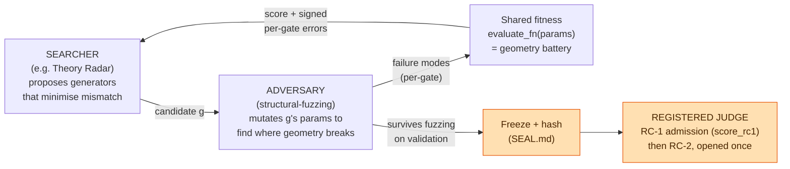

# Adversarial generator discovery (method)

*How OpenVector Bench proposes to find the missing artifact — a procedural
generator whose geometry matches real embeddings (RC-1) — without gaming the
gates.*

> **Status:** method + scaffold. The fitness harness ships
> (`openvector_bench/generator_search.py`); **no generator passes RC-1 yet**, and
> nothing here touches the sealed RC-2 set. This document is the design, its
> rationale, and — as importantly — its limits.

---

## 1. The problem, restated

Everything above the real/procedural seam (tiers T6–T12, the RC-2 seal) waits on
**one** artifact: a deterministic, byte-reproducible generator whose geometry
matches real embeddings across the RC-1 grid. The known-simple recipes fail —
`null_lowrank` (the recipe behind the existing 1B/10B synthetic corpora) has
~1/7 the **hubness** of real data, ~2× the **intrinsic dimension**, and is
trivially PCA-compressible. What makes it hard:

- **Hubness, and its growth with N**, is an emergent property with no closed-form
  recipe; a generator matched at n = 2×10⁵ can diverge by 10⁹.
- **The determinism ⟷ realism squeeze:** regeneration must be byte-identical
  across platforms at 10¹² scale (`DISTRIBUTION.md` §3), which rules out most ML
  generators (non-reproducible across versions/hardware). The generator must be a
  simple, exact function of `(seed, row)` yet rich enough to reproduce hubness.

So generator design is a **search over model space with a registered fitness** —
and the danger of pointing a strong optimiser at a fixed metric is Goodhart's
law: it will *match the statistics without the mechanism*.

## 2. The method: search × adversary × registered judge

Three roles, deliberately separated:



- **Searcher** — a discovery engine (Theory Radar: A\*-style beam search with
  learned *admissible* pruning and leakage-free evaluation) explores the space of
  generator constructions, minimising the geometry mismatch.
- **Adversary** — `structural-fuzzing` takes a candidate that "passes" and
  *mutates its parameters to find where its geometry diverges from real*. This is
  the anti-Goodhart engine: a generator that only games the eight gates fails
  under perturbation; one with the right mechanism is robust. Its `spectral_probe`
  targets exactly the compressibility divergence that sinks `null_lowrank`.
- **Registered judge** — the RC-1 admission rule (`score_rc1.py`, mandatory
  G1/G5/G6 in every cell + "all but two" + scaling exponents) and then the
  **sealed, one-shot RC-2**. Neither is optimised against.

The loop is adversarial co-evolution (GAN-shaped, but with an honest external
judge): searcher proposes → adversary attacks → discovered failures become harder
fitness → searcher finds a generator robust to the attack → converge.

## 3. The shared contract — one `evaluate_fn`, two engines

Both engines plug into a single function, `structural-fuzzing`'s signature:

```python
evaluate_fn(params: np.ndarray) -> tuple[float, dict[str, float]]
#            ^ generator knobs      ^ mismatch    ^ signed per-gate errors
```

`make_evaluate_fn(target, dim=…)` (in `generator_search.py`) returns exactly this.
It **reuses OpenVector Bench's own geometry battery** (`geometry.py`), so the
objective *is* the RC-1 measurement, not a re-implementation:

- `params` decode into a byte-reproducible generator (`synth_corpus`): heavy-tailed
  cluster sizes → density gradients → **hubness**; a within-cluster power-law
  spectrum → **effective rank / compressibility**; a noise floor → off any exact
  subspace. (These are the search substrate, not a claim of correctness.)
- `score` = mean `|log-ratio|` between the candidate's gates and the real target,
  across both batteries and every k, mandatory gates up-weighted — the searcher
  minimises it.
- `errors` = `{"g6_hubness_skew@Bk10": +0.7, …}` signed per-cell deviations — the
  adversary's per-target failure signal (which gate breaks, in which direction).

The same function is the searcher's fitness and the fuzzer's objective. Building
it is the one gating engineering step; the rest is wiring.

## 4. Why this might be novel

Fuzzing is normally used to break *software*; `structural-fuzzing` already
generalises it to *break a model's parameter space*. Using it as the
**anti-Goodhart regulariser inside a discovery loop against a pre-registered
scientific gate** — searcher builds, fuzzer breaks, a sealed judge rules — is, as
far as we can tell, a new combination. The pieces are independently published
(Theory Radar; `structural-fuzzing`; the RC-1 pre-registration); the contribution
is the composition and the shared geometry-battery fitness that makes it run.

## 5. Integrity guardrails (binding)

The method must not become a laundered way to overfit:

1. **The seal stays sealed.** Search and fuzz on **train/validation only**. The
   25% sealed test is opened **once**, against one frozen, hashed generator
   (`SEAL.md`). Fuzzing against RC-2 would burn the shot and is the exact
   adaptive manoeuvre the pre-registration forbids.
2. **Disjoint adversary and selection sets.** The fuzzer must attack on held-out
   geometric probes / a nested split, or the adversary quietly trains the
   searcher on the eventual test.
3. **Report the budget.** PREREG §7 requires the iteration count; a searcher ×
   fuzzer loop is a large multiple-comparisons load and must be disclosed.
4. **The battery is a fitting signal, not the verdict.** Passing the eight gates
   does not make a generator right (`RC1_ROUND1.md` said so); RC-2 is the test.

## 6. Honest limits

- **It cannot certify 10¹².** No real embeddings exist there. Fuzzing *can* stress
  the **N-axis** — perturb sub-sample size across the grid and check the *scaling
  form* (hubness/ID exponents), not just the level — which is the strongest
  extrapolation evidence obtainable short of real data, but it is not a proof.
- **Determinism constraint stands.** Any generator the loop finds must remain a
  byte-exact function of `(seed, row)`; candidate families that aren't are out of
  scope regardless of how well they score.
- **A pass is necessary, not sufficient.** RC-1 + RC-2 together establish
  geometry-match plus one held-out prediction — a strong bar, not omniscience.

## 7. Next steps

1. Precompute the real target with `measure_corpus` on Cohere Embed-V3 (train /
   validation splits, both batteries, the full k-grid).
2. Point Theory Radar's beam+prune at `evaluate_fn`; let `structural-fuzzing`
   adversarially validate each surviving candidate; iterate.
3. Freeze + hash the winner into `SEAL.md`; run `score_rc1`; open RC-2 **once**.

Nothing above the seam ships unless step 3 passes on data none of steps 1–2 saw.
